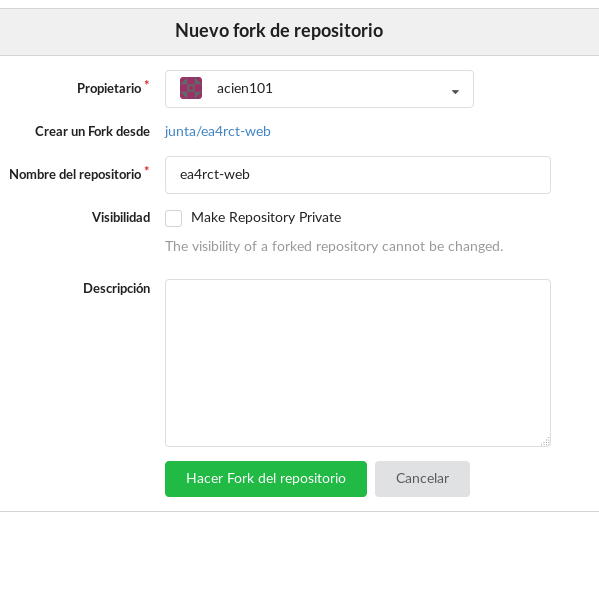
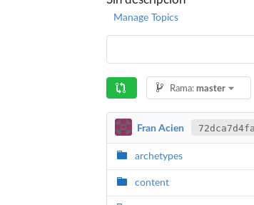
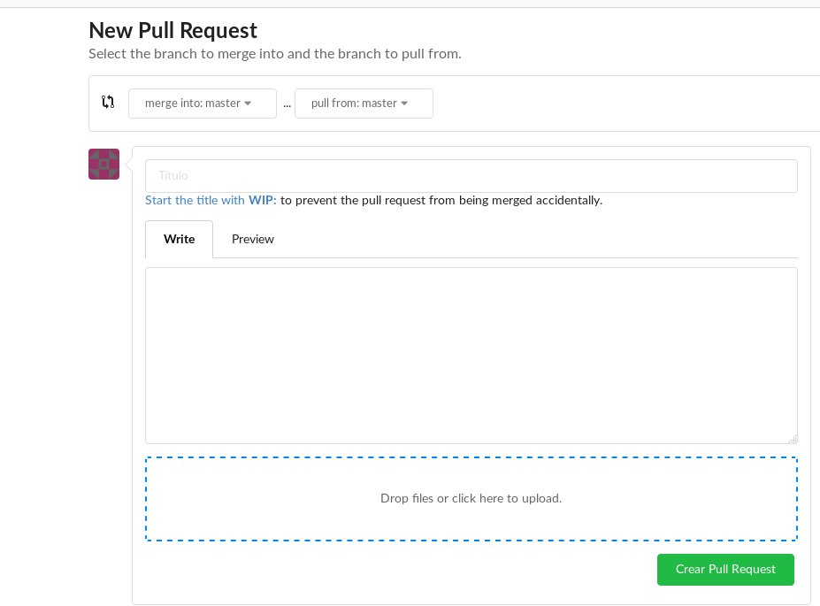

# EA4RCT-web

Este es el repositorio de la nueva web del Radioclub. Está alojada en `radio.clubs.etsit.upm.es`. Está creada con [gohugo](https://gohugo.io/), [Markdown](http://es.wikipedia.org/wiki/Markdown) y `HTML/CSS`.

## ¿Cómo está desarrollada?

La plantilla está creada con `HTML/CSS/BOOTSTRAP`, aunque cada página individual está escrita en markdown con la idea de simplificar su creación y mantener un estilo uniforme en toda la web.

El repositorio se tiene que clonar de forma recursiva: `git clone https://github.com/RadioClub-E-I-T/ea4rct-web`

Para tareas de construcción, está hecho con `gohugo`.

La página cuenta con algunas automatizaciones hechas con *Zapier*:

1. Cuando se publica una nueva actividad se envia directamente un correo a la lista de correo del radioclub y se añade la actividad al calendario del RadioClub.

2. Cuando se publica un nuevo post en el blog se envia un correo a la lista de correo del radioclub.

## ¿Cómo instalar Hugo?

Para instalar Hugo en tu máquina Linux escribe en el terminal `sudo apt-get install hugo`. La version de hugo que se está ejecutando es `v0.68.3/extended`

Para más información: [Install Hugo](https://gohugo.io/getting-started/installing/)
Ejecutas el comando en la terminal para que funcione
```
$hash -r
```

## ¿Cómo usar Hugo?

Para utilizar Hugo vete a la carpeta raiz  de la web y ejecuta:

```
$ hugo server
```

## ¿Cómo trabajar con este repositorio?

Para poder enviar tu trabajo a la página web tendrás que copiar el repositorio global a tu usuario personal (fork), hacer tus cambios, y luego enviarlos al repositorio global para que sea revisado por algún admin y se añada a la página web.

Para hacer esto:

1. Crea una copia del repositorio original (`junta/ea4rct-web`) en tu cuenta de usuario, esto se llama hacer un *fork*. Para ello pulsa el botón llamado *cuchillo* o *fork*:

    

2. Aparecerá en pantalla alguna información referente al *fork*. Con lo que estamos haciendo, crearemos una copia exacta (de la web en el momento en el que haces el fork) en tu usuario.

    

3. Clona el repositorio en tu ordenador. Para ello vete a al repositorio clonado, pulsa HTTPS, y luego copia la URL que te darán. La URL será de la forma `git@github.com:RadioClub-E-I-T/ea4rct-web.git`:

    

    Abre una terminal ejecuta, cambiando `URL_REPO_FORK` con la URL anteriormente copiada:
    `$ git clone --recursive URL_REPO_FORK`
4. Añade nuevas actividades/posts. Más abajo se explica cómo se hace para añadir nuevas actividades o posts paso a paso.
5. Cuando tengas terminados tus cambios, revisa que todo está en orden:
    ```
    $ cd ea4rct-web/
    $ hugo server
    ```
    En la salida del comando, te dirá que la web está en localhost, en algún puerto. Abre esa web y verás lo que has cambiado en el navegador. Revisa que todo está en órden.
6. Cuando tengas todo listo, sube los cambios a tu repositorio:
    ```
    $ git add .
    $ git commit -m "COMENTARIO DE LO QUE HAS CAMBIADO"
    $ git push
    ```
7. Para enviar los cambios al repositorio *global* tendrás que crear un **Pull Request**, es decir, una petición para que tus cambios se añadan al servidor, con el visto bueno de algún administrador. Ve a tu repositorio y pulsa:

    

    Eso te llevará a una pestaña donde tienes describir los cambios que has realizado. Pulsa en el botón *Crear Pull Request*, y tus cambios se enviarán al repositorio global. Cuando alguien le de el visto bueno, tus cambios se subirán a la web.

    

## ¿Cómo añadir una nueva actividad?

Para añadir una nueva actividad a la página web, copia el fichero `examples/2018-12-02-Taller-ejemplo.md` en la carpeta `content/activities/` y llámalo con el nombre de la actividad, siguiendo la forma `YYYY-MM-DD-Nombre-actividad.md`. Por ejemplo:

```
2018-09-10-Taller-Arduino.md
```

Y las carpetas quedarán de la forma:

```
├── content
│   ├── activities
│   │   ├── 2018-09-10-Taller-Arduino.md
```

Actualiza el fichero con la información de la actividad.

Para ver la página de la actividad ejecuta `snap run hugo server` y entra en la dirección que te proporciona el comando.

## ¿Cómo añadir un nuevo post al blog?

Para añadir un nuevo post al blog, copia el fichero `examples/2019-01-28-Nombre-del-post-del-blog.md` en la carpeta `content/blog/` y llámalo con un nombre descriptivo del blog:

```
2019-01-28-Nombre-del-post-del-blog.md
```

Y las carpetas quedarán de la forma:

```
├── content
│   ├── blog
│   │   ├── 2019-01-28-Nombre-del-post-del-blog.md
```

Actualiza el fichero con la información del post. Echa un vistazo antes a las categorias y los tags, para poner los tags que encajen con tu post.

Para ver la página de la actividad ejecuta `snap run hugo server` y entra en la dirección que te proporciona el comando.

## Cómo añadir gente a Team

La pestaña team tiene todos los miembros de la junta año por año. Para añadir nuevos miebros al team (Ej: Nueva junta) copia el fichero `examples/NOMBRE.md` en la carpeta `content/team/AÑO/` y llámalo con el nombre de la persona. Para que siga un orden (el presidente el primero), se puede poner al principio un número, que indicará de menor a mayor la posición en la web:

```
1FranAcien.md
```

Y las carpetas quedarán de la forma:

```
├── content
│   ├── team
|   |   ├── 1819
│   │   |    ├── 1FranAcien.md
│   │   |    ├── 2NachoLopez.md
│   │   |    ├── 3SergioSanchez.md
```

Actualiza el fichero con la información de la persona.

Las imágenes guárdalas en el directorio `static/team/`, y para referenciarla será `/team/facien.jpg`, por ejemplo.

Para ver que todo está en órden, ejecuta `snap run hugo server` y entra en la dirección que te proporciona el comando.

## Cómo añadir un nuevo proyecto

La pestaña de proyectos tiene recogido cuales han sido los proyectos todos los años. Para añadir un nuevo proyecto a la lista copia el fichero `examples/PROYECTO.md` en la carpeta `content/proyectos` y llámalo con el nombre del proyecto.

Actualiza el fichero con la información del proyecto. Ten en cuenta que la variable `category` tiene el nombre de la categoría donde estarán los posts relacionados con ese proyecto.

Las imágenes guárdalas en el directorio `static/proyectos/`, y para referenciarla será `/proyectos/fotoproyecto.jpg`, por ejemplo.

Para ver que todo está en órden, ejecuta `snap run hugo server` y entra en la dirección que te proporciona el comando.

## Añadiendo imágenes

Si quieres añadir imagenes en tu página, pon las imágenes en `static/blog/TITULODELPOST/` si es un post del blog, y `static/activities/TITULO_DE_LA_ACTIVIDAD`. Y en el post puedes referencial la imagen así:

```

```


## Añadiendo ecuaciones matemáticas

Las ecuaciones matemáticas se hacen con MathJax **siguiendo la sintaxis de LaTeX**.

Cuando quieras añadir una ecuación matemática, hazlo de la siguiente forma:

```
<div>
$$
\sqrt{\frac{\lambda}{\ro}}
$$
</div>
```

En hugo actualmente hay problemas con el `_`, que se utilizan para los subíndices , tienes que escribirlo de la forma `$ 2\_{asdf} $` o `$ var_ 2$`.

Para escribir ecuaciones *in line* se haría así: `Estamos hablando de un tema de \\( \lambda /2 \\)`
